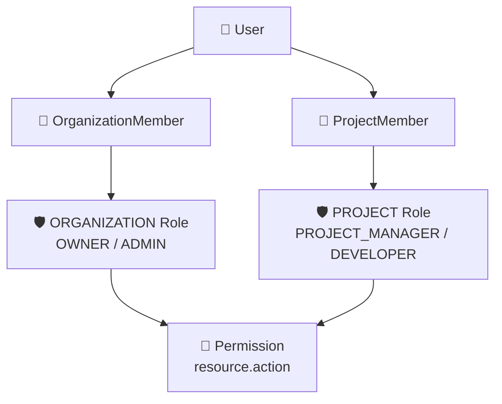
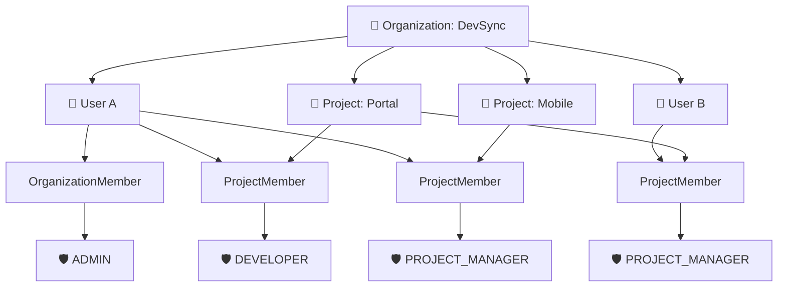
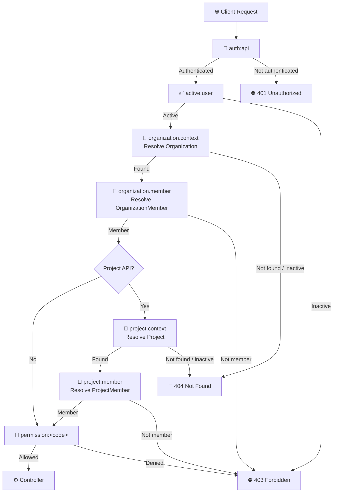
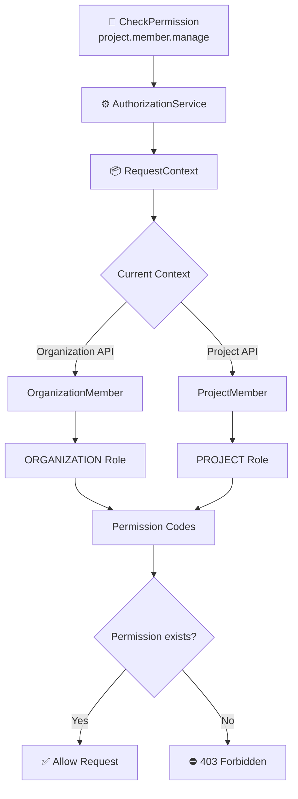
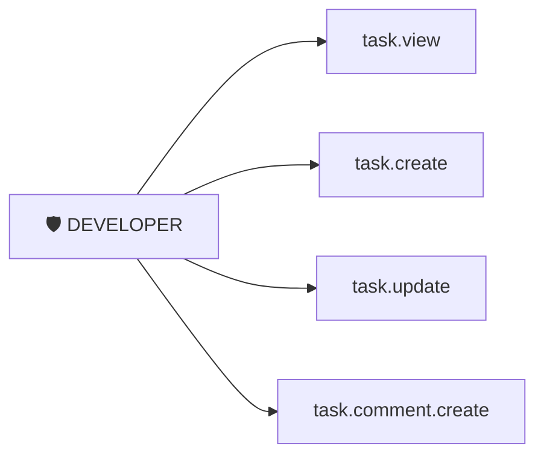
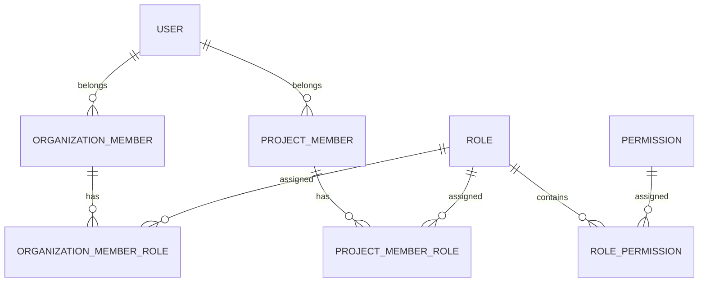
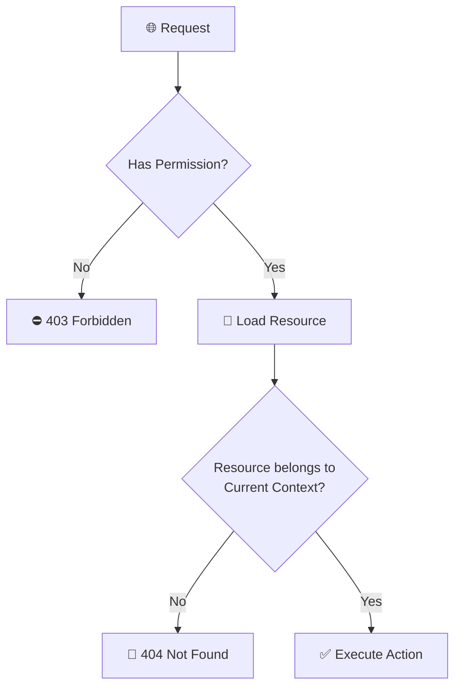
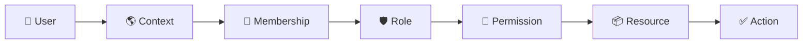

# 🔐 Authorization — DevSync

Tài liệu này mô tả cơ chế **Authorization** đang được sử dụng trong DevSync.

Hệ thống sử dụng mô hình:

> **RBAC — Role-Based Access Control**

User không được gán permission trực tiếp.

Permission được cấp thông qua:

```text
User
→ Member
→ Role
→ Permission
```

DevSync có hai phạm vi phân quyền độc lập:

* `ORGANIZATION`
* `PROJECT`

---

# 1. Authorization Overview

## Core concepts

### Permission

`Permission` đại diện cho một hành động cụ thể mà user được phép thực hiện.

Ví dụ:

```text
organization.member.invite
organization.member.manage

project.member.view
project.member.manage

task.comment.create
```

Permission nên được đặt theo convention:

```text
resource.action
```

Ví dụ:

```text
task.create
task.update
task.delete

task.comment.create
```

---

### Role

`Role` là tập hợp nhiều permission.

Ví dụ:

```text
OWNER
ADMIN

PROJECT_MANAGER
DEVELOPER
```

Một Role luôn thuộc:

```text
Organization
```

và có một trong hai scope:

```text
ORGANIZATION
PROJECT
```

---

## Authorization model



Ý tưởng chính:

```text
User
   │
   ├── OrganizationMember
   │       │
   │       └── ORGANIZATION Role
   │                   │
   │                   └── Permission
   │
   └── ProjectMember
           │
           └── PROJECT Role
                       │
                       └── Permission
```

User **không sở hữu permission trực tiếp**.

---

# 2. Role Scope Model

Một User có thể có role khác nhau tùy theo Organization hoặc Project đang truy cập.

Ví dụ:



Trong ví dụ trên:

```text
User A

Organization DevSync
└── ADMIN

Project Portal
└── DEVELOPER

Project Mobile
└── PROJECT_MANAGER
```

Điều này có nghĩa:

> Role của User không phải là thuộc tính toàn cục.

Role luôn phụ thuộc vào **context hiện tại**.

---

# 3. Request Context

Authorization không chỉ dựa vào User đang đăng nhập.

Mỗi request cần xác định context hiện tại.

DevSync sử dụng:

```php
RequestContext
```

Context có thể chứa:

```php
$context->organization;

$context->organizationMember;

$context->project;

$context->projectMember;
```

---

## Organization API

Request cần:

```http
Authorization: Bearer <JWT>
X-Organization-Code: devsync
```

Context sau khi resolve:

```text
User
+
Organization
+
OrganizationMember
```

---

## Project API

Request cần:

```http
Authorization: Bearer <JWT>
X-Organization-Code: devsync
X-Project-Code: portal
```

Context sau khi resolve:

```text
User
+
Organization
+
OrganizationMember
+
Project
+
ProjectMember
```

---

# 4. Authorization Request Flow

Middleware phải chạy theo đúng thứ tự.



Middleware pipeline tương ứng:

```text
auth:api
   ↓
active.user
   ↓
organization.context
   ↓
organization.member
   ↓
project.context
   ↓
project.member
   ↓
permission:<code>
   ↓
controller
```

Hai middleware:

```text
project.context
project.member
```

chỉ tồn tại trên các API thuộc Project scope.

---

# 5. Organization Route Example

Ví dụ endpoint mời thành viên vào organization:

```php
Route::prefix('organization')
    ->controller(OrganizationMemberController::class)
    ->middleware([
        'auth:api',
        'active.user',
        'organization.context',
        'organization.member',
    ])
    ->group(function () {

        Route::post('/members', 'store')
            ->middleware(
                'permission:organization.member.invite'
            );

    });
```

Flow:

```text
User authenticated
        ↓
User active
        ↓
Organization resolved
        ↓
OrganizationMember resolved
        ↓
Has organization.member.invite?
        ↓
Controller
```

---

# 6. Project Route Example

Ví dụ endpoint xóa member khỏi project:

```php
Route::prefix('project')
    ->controller(ProjectMemberController::class)
    ->middleware([
        'auth:api',
        'active.user',
        'organization.context',
        'organization.member',
        'project.context',
        'project.member',
    ])
    ->group(function () {

        Route::delete('/members/{member}', 'destroy')
            ->middleware(
                'permission:project.member.manage'
            );

    });
```

Flow:

```text
User authenticated
        ↓
Organization resolved
        ↓
OrganizationMember resolved
        ↓
Project resolved
        ↓
ProjectMember resolved
        ↓
Has project.member.manage?
        ↓
Controller
```

---

# 7. Permission Resolution Flow

Khi route sử dụng:

```php
->middleware('permission:project.member.manage')
```

middleware `CheckPermission` sẽ gọi Authorization Service.



---

## Organization API

Authorization Service chỉ kiểm tra:

```text
OrganizationMember
        ↓
ORGANIZATION roles
        ↓
Permissions
```

---

## Project API

Authorization Service chỉ kiểm tra:

```text
ProjectMember
        ↓
PROJECT roles
        ↓
Permissions
```

Role sai scope sẽ không được sử dụng.

Ví dụ:

```text
Organization ADMIN
```

không tự động đồng nghĩa với:

```text
Project ADMIN
```

trừ khi permission model của hệ thống được thay đổi để hỗ trợ hành vi đó.

---

# 8. Role → Permission

Một Role có thể chứa nhiều Permission.



Ví dụ:

```text
DEVELOPER
├── task.view
├── task.create
├── task.update
└── task.comment.create
```

Một User có nhiều Role thì permission cuối cùng là tập hợp permission có hiệu lực của các role đó.

---

# 9. Database Relationship

Quan hệ logic giữa các entity:



Các pivot chính:

```text
organization_member_roles

project_member_roles

role_permissions
```

Các relationship này đều hỗ trợ trạng thái:

```text
is_active
```

Permission chỉ có hiệu lực khi các thành phần liên quan vẫn còn active.

---

# 10. Protected Resource Access

Có permission **không đồng nghĩa** với việc User được truy cập mọi resource có ID hợp lệ.

Ví dụ:

```http
DELETE /project/tasks/999
```

User có thể có permission:

```text
task.delete
```

nhưng task `999` có thể thuộc Project khác.

Vì vậy DevSync cần hai lớp kiểm tra.



Công thức:

```text
Authorization
=
Permission
+
Correct Context
+
Resource Scope
```

Không nên viết:

```php
Task::findOrFail($taskId);
```

Nếu API đang hoạt động trong Project context.

Nên scope theo project:

```php
$context = app(RequestContext::class);

$task = Task::query()
    ->where(
        'project_id',
        $context->project->id
    )
    ->findOrFail($taskId);
```

Việc này giúp tránh truy cập resource thuộc Project khác thông qua việc đoán ID.

---

# 11. HTTP Status

Các response Authorization thường gặp:

| Status | Ý nghĩa                                                       |
| ------ | ------------------------------------------------------------- |
| `400`  | Thiếu context/header bắt buộc                                 |
| `401`  | Chưa đăng nhập / token không hợp lệ                           |
| `403`  | User không đủ quyền hoặc membership không hợp lệ              |
| `404`  | Organization / Project / Resource không tồn tại trong context |
| `2xx`  | Request được phép thực hiện                                   |

---

# 12. Adding New Permission

Khi thêm một feature mới, trước tiên tạo permission.

Ví dụ:

```text
task.comment.create
```

Seeder:

```php
$permission = Permission::firstOrCreate(
    [
        'code' => 'task.comment.create',
    ],
    [
        'name' => 'Create task comment',
        'resource' => 'task.comment',
        'action' => 'create',
    ],
);
```

---

# 13. Assign Permission To Role

Ví dụ thêm permission cho role:

```text
DEVELOPER
```

trong Project scope:

```php
$role = Role::where(
        'organization_id',
        $organization->id
    )
    ->where(
        'scope',
        Role::SCOPE_PROJECT
    )
    ->where(
        'code',
        'DEVELOPER'
    )
    ->firstOrFail();

$role->permissions()->syncWithoutDetaching([
    $permission->id => [
        'is_active' => true,
    ],
]);
```

---

# 14. Assign Role To Project Member

```php
$projectMember
    ->roles()
    ->syncWithoutDetaching([
        $role->id => [
            'assigned_at' => now(),
            'assigned_by' => auth()->id(),
            'is_active' => true,
        ],
    ]);
```

Đối với Organization:

```php
$organizationMember->roles();
```

Role được gán phải:

```text
✓ thuộc đúng Organization

✓ đúng Scope

✓ đang active
```

---

# 15. Adding Protected Route

Ví dụ thêm tính năng:

```text
POST /project/tasks/{task}/comments
```

Permission:

```text
task.comment.create
```

Route:

```php
Route::prefix('project/tasks')
    ->controller(TaskCommentController::class)
    ->middleware([
        'auth:api',
        'active.user',
        'organization.context',
        'organization.member',
        'project.context',
        'project.member',
    ])
    ->group(function () {

        Route::post(
            '/{task}/comments',
            'store'
        )->middleware(
            'permission:task.comment.create'
        );

    });
```

---

# 16. When Should We Add New Middleware?

Không nên tạo middleware riêng cho từng nghiệp vụ:

```text
❌ can.create.task
❌ can.delete.task
❌ can.manage.member
```

Các khả năng nghiệp vụ nên được biểu diễn bằng:

```text
permission:<code>
```

Ví dụ:

```text
permission:task.create

permission:task.delete

permission:project.member.manage
```

Middleware mới chỉ nên được tạo cho điều kiện chung như:

```text
MFA required

Subscription active

Project not archived

Tenant enabled
```

Ví dụ:

```text
project.not_archived
```

---

# 17. Authorization Design Principles

## Do not authorize by Role directly

Không nên:

```php
->middleware('role:ADMIN')
```

Nên:

```php
->middleware(
    'permission:organization.member.invite'
)
```

Role chỉ có nhiệm vụ:

```text
Role
    ↓
Group Permissions
```

Route chỉ cần biết:

```text
User có permission này hay không?
```

---

## Always use Context

Không truy vấn resource toàn cục nếu request đang nằm trong Organization hoặc Project context.

Không nên:

```php
Project::find($id);
```

nếu Organization đã được resolve.

Nên:

```php
Project::query()
    ->where(
        'organization_id',
        $context->organization->id
    )
    ->findOrFail($id);
```

---

# 18. Authorization Mental Model

Khi debug authorization, hãy suy nghĩ theo thứ tự:



Có thể nhớ bằng công thức:

```text
WHO
 ↓
WHERE
 ↓
MEMBER?
 ↓
ROLE?
 ↓
PERMISSION?
 ↓
RESOURCE IN CONTEXT?
 ↓
ACTION
```

---

# 19. Developer Checklist

Khi thêm chức năng mới:

* [ ] Xác định feature thuộc `ORGANIZATION` hay `PROJECT`
* [ ] Tạo Permission code
* [ ] Seed Permission
* [ ] Gán Permission cho Role phù hợp
* [ ] Kiểm tra Role đúng Organization
* [ ] Kiểm tra Role đúng Scope
* [ ] Thêm middleware context đúng thứ tự
* [ ] Thêm `permission:<code>` vào route
* [ ] Scope resource theo `RequestContext`
* [ ] Test user không đăng nhập
* [ ] Test user inactive
* [ ] Test sai Organization
* [ ] Test sai Project
* [ ] Test thiếu Permission
* [ ] Test resource thuộc context khác
* [ ] Test request hợp lệ

---

# 20. Recommended Tests

Authorization feature nên có ít nhất:

```text
Unauthenticated
        → 401

Inactive User
        → 403

Invalid Organization
        → 404

Not Organization Member
        → 403

Invalid Project
        → 404

Not Project Member
        → 403

Missing Permission
        → 403

Valid Permission
        → 2xx

Resource From Another Project
        → 404
```

Các test hiện có có thể tham khảo:

```text
tests/Feature/AuthorizationContextTest.php

tests/Feature/OrganizationDashboardTest.php
```

---

# 21. Summary

DevSync Authorization có thể tóm tắt thành:

```text
User
 ↓
Context
 ↓
Membership
 ↓
Role
 ↓
Permission
 ↓
Resource Scope
 ↓
Action
```

Hoặc:

```text
┌──────────┐
│   User   │
└────┬─────┘
     │
     ▼
┌──────────┐
│ Context  │
└────┬─────┘
     │
     ▼
┌────────────┐
│ Membership │
└─────┬──────┘
      │
      ▼
┌──────────┐
│   Role   │
└────┬─────┘
     │
     ▼
┌────────────┐
│ Permission │
└─────┬──────┘
      │
      ▼
┌──────────────┐
│ Resource     │
│ Scope        │
└──────┬───────┘
       │
       ▼
┌────────────┐
│   Action   │
└────────────┘
```

> **Role defines what permissions a member has.
> Context defines where those permissions are valid.
> Resource scoping defines which data those permissions can act on.**
